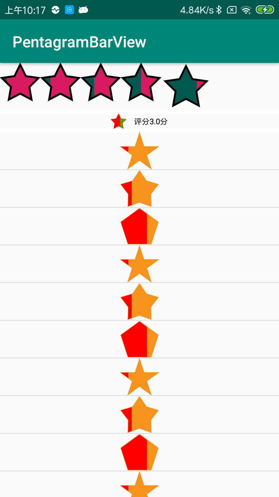

# PentagramBarView

五角星进度条。

## 关于五角星的角度，内切圆，外接圆的计算；需要你就有数学功底，不过，初中的数学知识就够用了，可以参考下图：

# 使用方法

# 属性说明

|属性|说明|备注|
|max|最大进度|默认的是100|
|progress|当前进度|0~max|
|CrRatio|五角星内切圆与外接圆的半径的比率；值越大，五角星就越“胖”，反之就越“瘦”，默认的是正五角星的比率| |
|fillColor|五角星填充的颜色| |
|progressColor|五角星进度条填充颜色| |
|lineColor|五角星线条颜色||
|lineWidth|五角星线条的宽度|如果不显示线条，设置为0|
|measure_style|WIDTH-以宽度为测量标准计算高度,HEIGHT-以高度为计算标准，计算宽度| |

